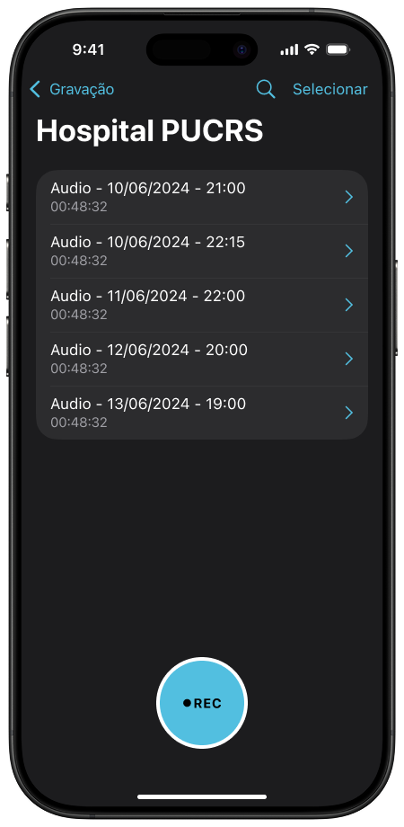
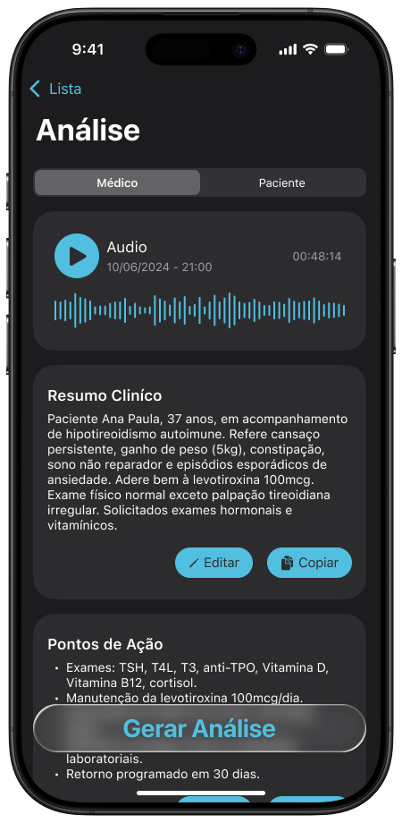
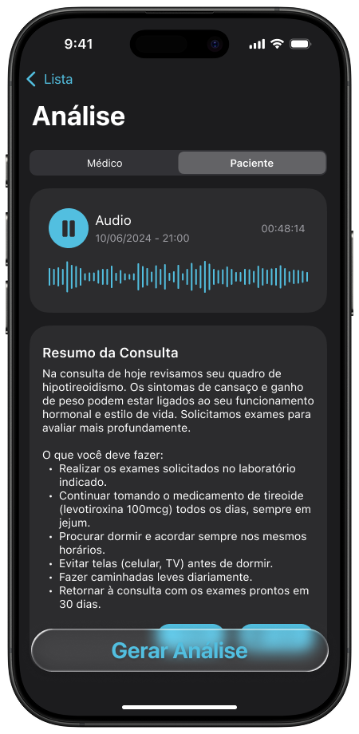
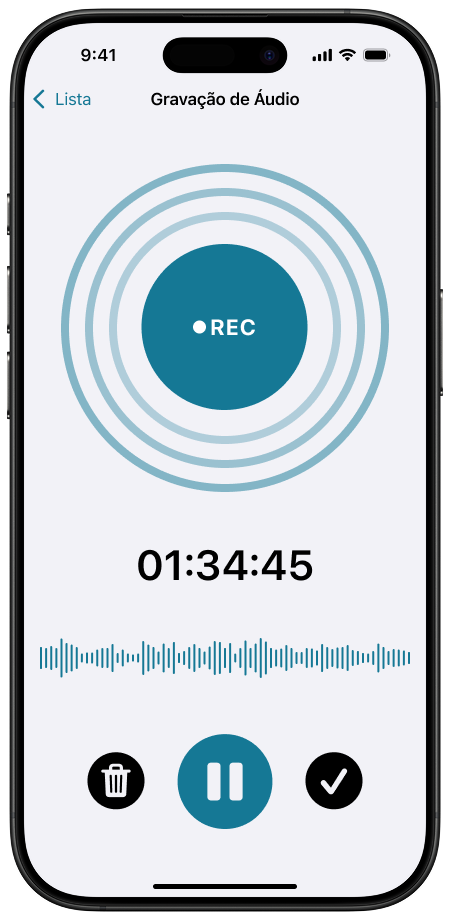
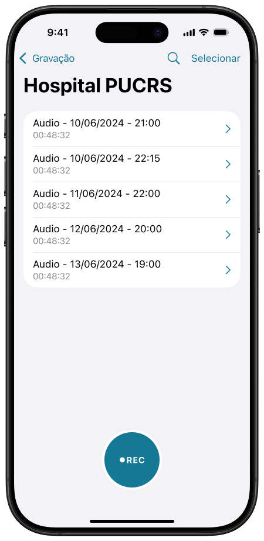
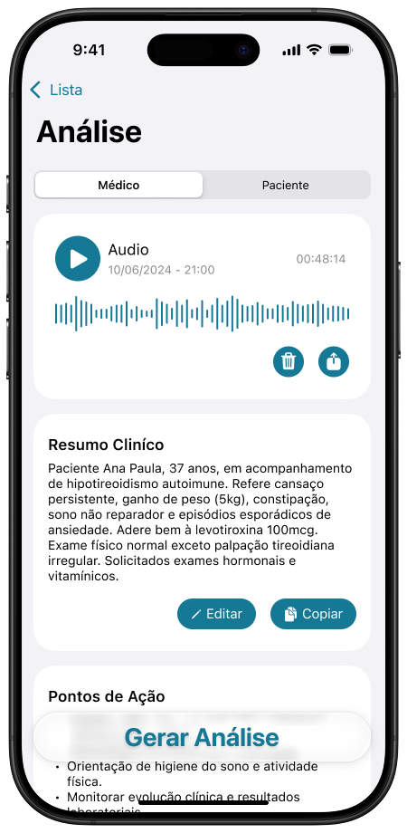
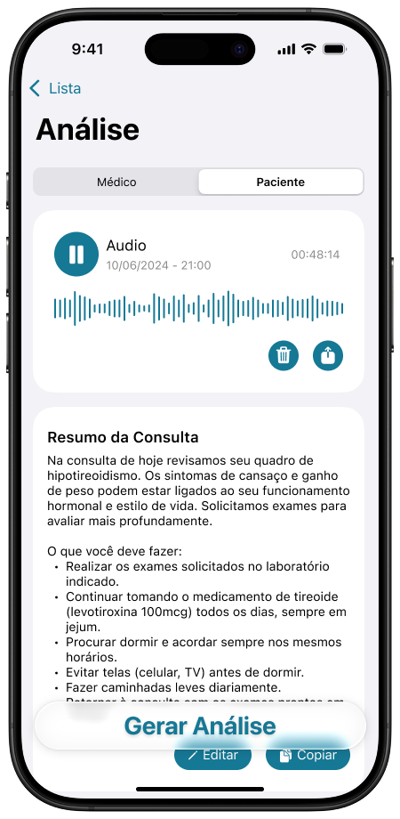

# 
Clairfy - resume suas consultas.  Para enviar aos seus pacientes

Este é um app pensado para melhor a comunicação entre o médico e seu paciênte. 

Fluxo do aplicativo:

- Grava a consulta, no seu iPhone
- Gera um resumo clínico para uso do médico
- Gera palavras-chaves da consulta para uso do médico
- Gera um resumo clínico para envio ao paciente
- Gera pontos de ação para envio ao paciente

---

## Tecnologias aplicadas:
- Design feito em Figma
- UFoco em UX como diferencial do produto
- Linguagem de programação utilizada: Swift
- UIKit
- AVFoundations
- API
- TableView
- Delegate
- Animation
- Componentes

---

## Imagens do Clairfy

